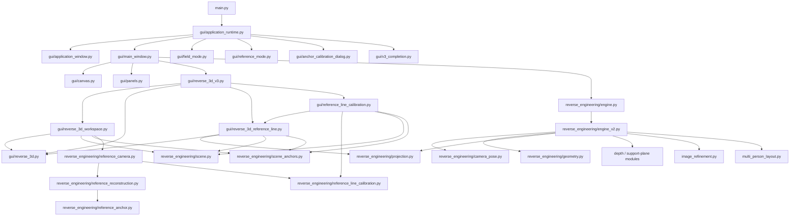

# Dependency graph

This document records the repository's current import boundaries and the cleanup decisions made during the 2026-09 architecture pass. It is intentionally organized by runtime ownership rather than filename history.

## Runtime graph

## Core ownership

`main.py` is the desktop/CLI entry point. `application_runtime.py` owns application composition, Settings, session I/O, calibration selection, and the runtime bridge between services and the window. `main_window.py` owns the main tabs and analysis worker; it now directly constructs the canonical V3 workspace.

`reverse_3d_v3.py` is the canonical V3 orchestrator. `reverse_3d_workspace.py` owns the editable 3D inspector, scene-anchor list, projection preview, candidates, reference hypothesis display, and people view. `reverse_3d.py` remains the low-level rendering layer (`SceneView`, `ProjectionPreview`) rather than a competing workspace.

`reverse_3d_reference_line.py` owns the compact projected reference-line and camera-match interaction. `reference_line_calibration.py` owns image evidence selection, semantic reference-line constraints, and roll apply/undo controls.

`reverse_engineering/engine.py` is the stable public import path. `engine_v2.py` is the active 2.5 implementation behind that compatibility alias. This pair is intentionally retained until the public V2 export is migrated; deleting `engine_v2.py` without moving its implementation would break the package.

## Cleanup performed

| Path | Decision | Reason |
|---|---|---|
| `gui/reverse_3d_reference.py` | removed | Historical adapter around `reverse_3d_workspace`; the only unique behavior was the PySide6 selected-anchor overlay and polling optimization, both now owned by canonical V3 code. |
| `gui/reference_line_apply.py` | removed | Small GUI-only roll controller folded into `reference_line_calibration.py`. |
| `gui/reverse_3d.py` | kept | Low-level scene/projection rendering; not a duplicate workspace. |
| `gui/reverse_3d_workspace.py` | kept | Actual editable 3D workspace and inspector implementation. |
| `gui/reverse_3d_reference_line.py` | kept | Actual reference-line projection and camera-match widgets. |
| `reverse_engineering/engine.py` | kept | Stable compatibility import path used by application code. |
| `reverse_engineering/engine_v2.py` | kept | Current V2.5 engine implementation; not dead code. |
| `reverse_engineering/reference_anchor.py` | kept | Used by `reference_reconstruction.py`; image-space and world-space anchors must remain distinct. |
| `reverse_engineering/camera_semantics.py` | removed | Symbol-level audit found no runtime import, package export, test dependency, or documented public API use; it was a standalone experimental data-structure module. |
| `assets/app_icon.svg` | removed | Replaced by the requested `assets/icon.png`; runtime now uses the PNG as the sole bundled application icon. |

## Files deliberately not merged

Camera geometry, reference reconstruction, scene geometry, scene anchors, plane constraints, and projection remain separate because they represent different mathematical contracts. Likewise, the 3D renderer is kept separate from the V3 workspace; merging those files would create one oversized UI/rendering module without reducing conceptual coupling.

## Test dependency surface

The deterministic tests cover coordinate contracts, camera/reference-camera behavior, reference-line calibration, scene model/anchors, rotation solving, regression behavior, and V3 completion. Model-backed inference remains outside the deterministic contract suite.

## Regeneration note

For future cleanup work, treat a file as removable only when it is unreachable from `main.py`, package exports, tests, and documented public import paths. A thin compatibility alias is preferable to a second implementation; a second implementation is not automatically dead code just because its filename carries a version suffix.
